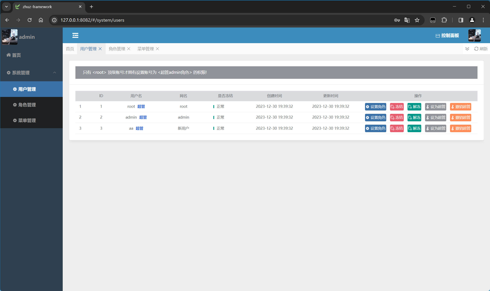
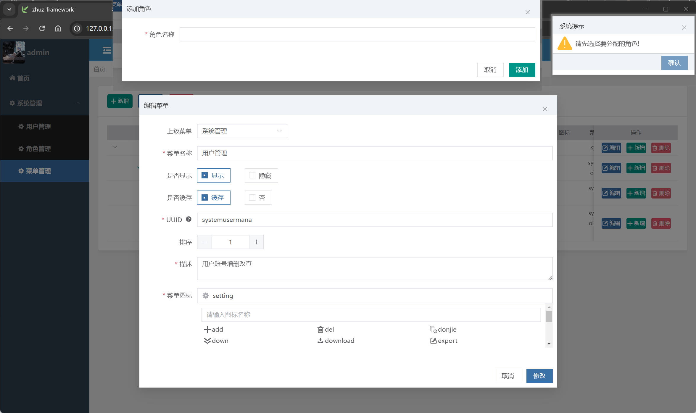
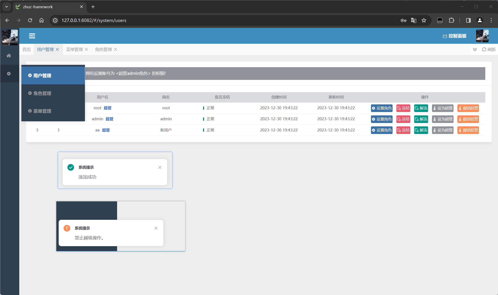
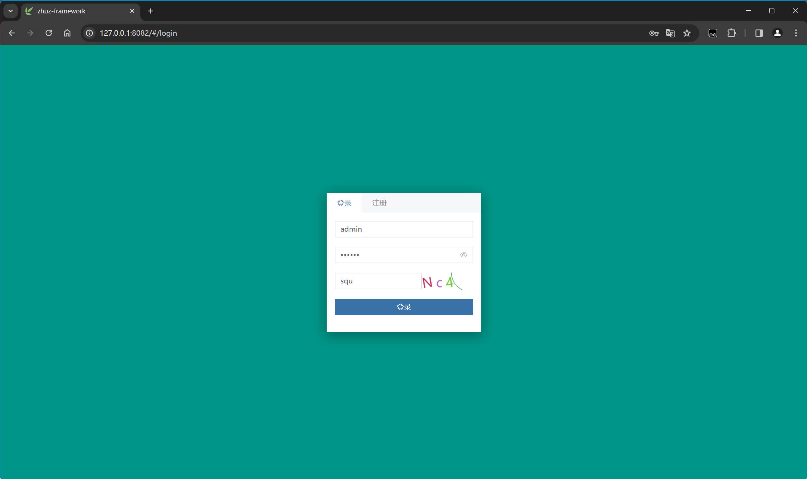
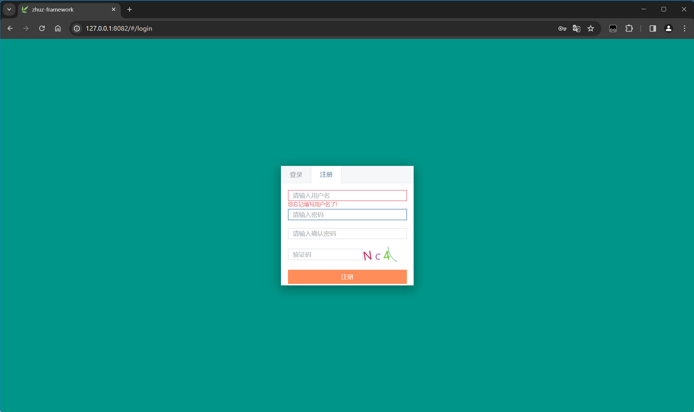

# 介绍

```
zhuz-admin 个人封装的简易的后台框架

ui-个人
配色-参照若依

路由/控制器/dto,服务,实体,工具拆分
分环境加载配置文件
全局统一异常捕获,错误提示
全局统一响应数据结构
通过接口对数据库生成表和初始化数据操作
日志管理
生成uuid,验证码,存储uuid验证码到redis,验证客户端请求uuid跟验证码
jwt鉴权,密码hash加密
joi参数校验,错误提示自定义控制
文件上传中间件封装
apipost 接口文件

有问题可联系作者!
作者企鹅号: 2282249330
```

# 源码说明

```
写了2个版本,node跟c#

若想部署,根据自己情况2选1就行!
```

## node版

```
后端
koa2+ts+mysql+redis
前端
vue3+ts+tailwindcss+vite
```

## c#版

```
后端
net6+mysql+redis
前端
vue3+ts+tailwindcss+vite
```


# 展示









